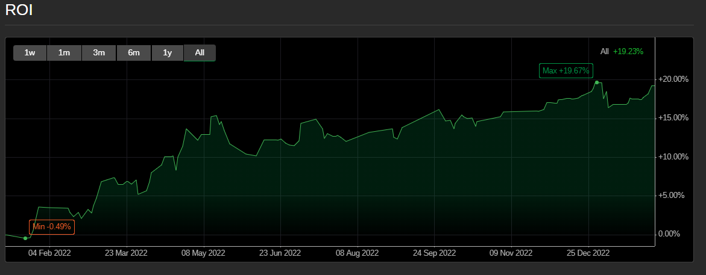
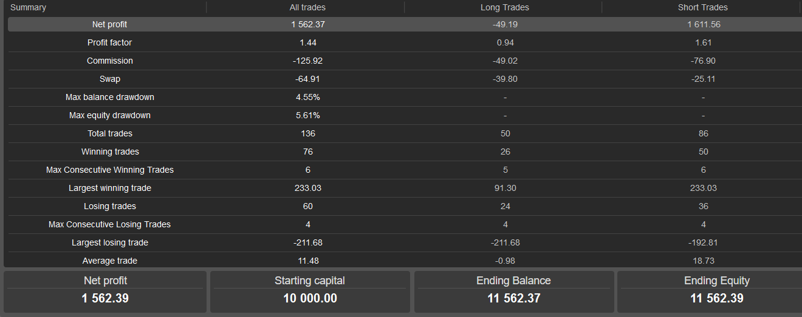

# Hybrid Trend-Following Bot for cTrader (cAlgo)

This is a fully-automated trading robot developed in C# for the cTrader platform. The bot implements a hybrid trend-following strategy designed to operate on EUR/USD. It combines multiple indicators for signal confirmation with advanced risk and trade management features.

## Key Features

This bot was designed to be robust and versatile. Its core features include:

* **Dynamic Position Sizing:** Automatically calculates trade volume based on a fixed percentage of account equity and the real-time volatility (ATR-based stop-loss).
* **Multi-Indicator Signal Confirmation:**
    * **Trend:** Uses a dual EMA (50/200) crossover system to define the primary trend.
    * **Strength:** Employs ADX to filter out low-momentum, choppy market conditions.
    * **Entry:** Uses RSI pullbacks for more precise entries within an established trend.
* **Advanced Trade Management:**
    * **Multi-Stage Exits:** Positions can be exited via Take Profit, Stop Loss, a time-based stop (`MaxBarsInTrade`), an RSI-based signal, or at the end of the defined trading session.
    * **Breakeven Function:** Automatically moves the stop-loss to entry price (+padding) to protect capital once a trade reaches a specified profit target.
    * **Partial Take-Profit:** Secures a percentage of the position's profit at a preliminary target, allowing the remainder to run.
* **Robust Risk Controls:**
    * **Hard Daily Limits:** Implements a daily maximum loss percentage and a maximum number of trades per day to prevent catastrophic losses.
    * **Pre-Trade Filters:** Includes filters for maximum allowable spread and a time-of-day session window to avoid unfavorable trading conditions.

## Built With

* **Language:** C#
* **Platform:** cTrader (cAlgo API)
* **IDE:** Visual Studio / cTrader Code Editor

## Configurable Parameters

The bot is highly configurable via the cAlgo interface. Key parameters include:

* `RiskPerTradePercent`: The percentage of equity to risk on a single trade.
* `RR`: The risk-to-reward ratio for setting the initial take-profit.
* `MaxLossDay`: The maximum percentage of account balance that can be lost in a single day before the bot stops trading.
* `MinAdx`: The minimum ADX value required to confirm a trend.
* `BeSlMultiplier` / `PtpSlMultiplier`: Multiples of the initial SL distance used to trigger breakeven and partial take-profit events.
* `Fixed lot size`: Does nothing, however code can be changed to allow it to run again. 
## Backtesting & Performance

* `ROI` : 
* `Trade states` : 
* `Parameters used`: [text]src/cTraderBot/NewBot3.1, EURUSD h12.cbotset

This project was a really fun personal project to work on. I’m amazed by how much there is to explore in the fields of machine learning, AI, and algorithmic trading. Although the backtesting was run on the 12h timeframe, the parameters shown (e.g., RiskPerTradePercent = 1.7%, RR = 1.2, MaxLossDay = 4.4%, etc.) are not the only ones that can yield profit. They simply fit the trading style I prefer—moderate risk with a balanced reward ratio and a strong emphasis on trend confirmation.

The biggest challenge was finding optimization parameters that work well outside the tested period. Grid optimization over multiple parameter combinations would take my laptop around 2,332 days of CPU time for exhaustive backtests. Even with the generic algorithm optimisationl i ran, results were sensitive to market regime shifts, indicating that further adaptive techniques (walk-forward analysis or genetic algorithms) might be necessary.

While this is a sophisticated bot, I do not believe it qualifies as a “good” bot in a live trading context. Drawdowns reached up to 5.6% of equity, and short trades drove most of the gains (net profit: $1,611 for shorts vs. –$49 for longs). This imbalance suggests the strategy may be overfitted to bearish conditions. I’d need to refine position sizing, add regime filters, and perform rigorous out-of-sample testing before considering live deployment.

Finally, I had a lot of fun learning how to integrate multiple indicators, manage trade lifecycle events, and handle performance analysis. I’m constantly growing and excited to explore more advanced techniques—such as machine learning–driven parameter selection and real-time adaptive risk management—on future projects.
